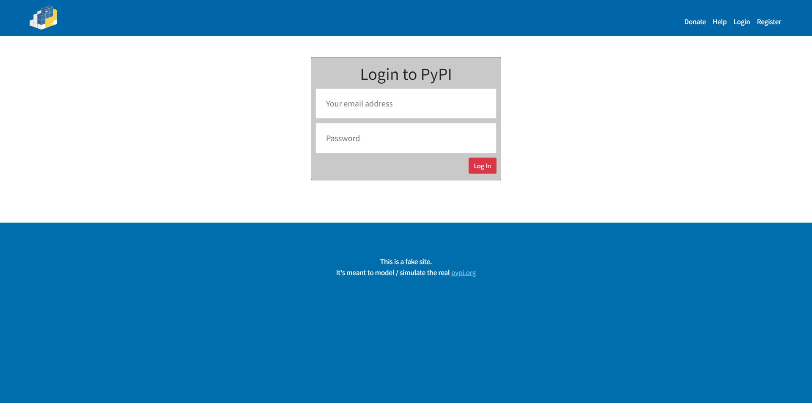

## FastAPI, Ormar, PostgreSQL, Alembic

Проект копирует pypi.org (упрощённо)
#### Возможности проекта:
* Создание, редактирование, удаление проектов и релизов
* Регистрация и вход в аккаунт (аутентификация, cookie, JWT)
* Функции с необходимостью авторизации ([127.0.0.1:8000/docs](127.0.0.1:8000/docs))
* Отображение информации о количестве проектов, релизов и пользователей
* Отдельная страница с полным описанием для каждого проекта

#### Запуск проекта:
* Клонировать репозиторий
```
https://github.com/Cpt-Potato/FastAPI_PyPI.git
```
* Перейти в папку с проектом
* Создать контейнеры со всеми нужными зависимостями и запустить их
```
docker-compose up
```
* Перейти по адресу [127.0.0.1:8000](127.0.0.1:8000) или [127.0.0.1:8000/docs](127.0.0.1:8000/docs)
### Также можно подключиться к локальной PostgreSQL (или другой БД)
* Изменить DATABASE_URL в файле .env.dev \
(заменить db на host.docker.internal для подключения к локальной БД из Docker)
* Активировать виртуальное окружение и сделать миграции для создания таблиц, \
либо импортировать db_dump.sql вместо этого шага
```
alembic revision --autogenerate -m "create tables"
alembic upgrade head
```
* Запустить контейнер с FastAPI
```
docker build -t {name} .
docker run -d -p "8000:8000" {name}
```
* Перейти по адресу [127.0.0.1:8000](127.0.0.1:8000) или [127.0.0.1:8000/docs](127.0.0.1:8000/docs)





